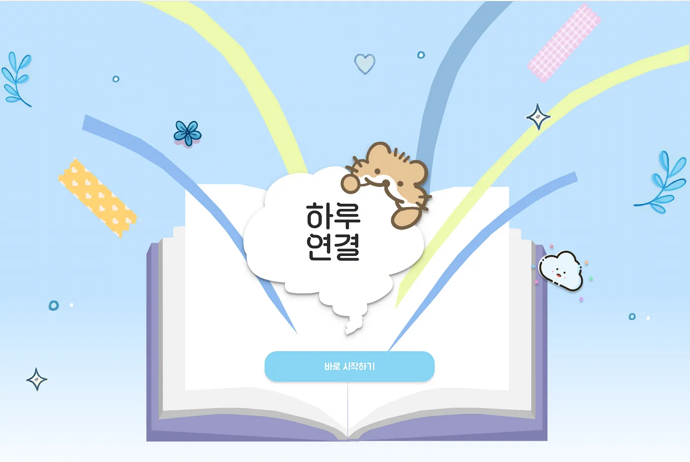
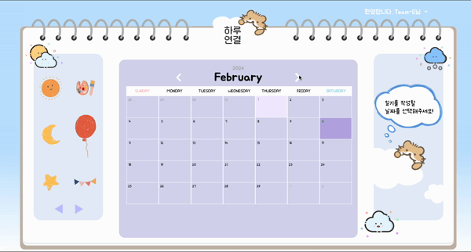
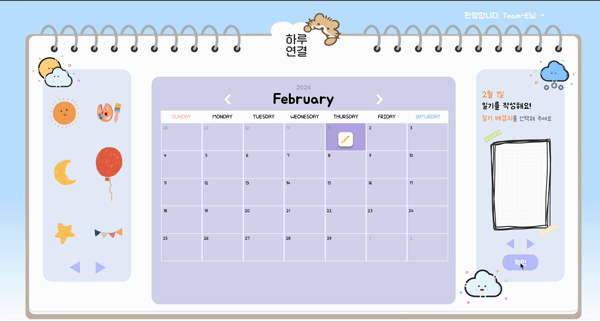
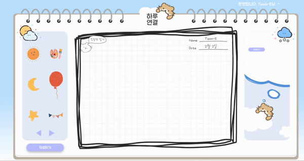
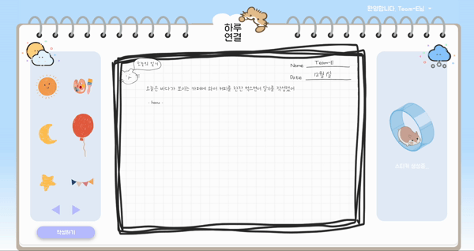
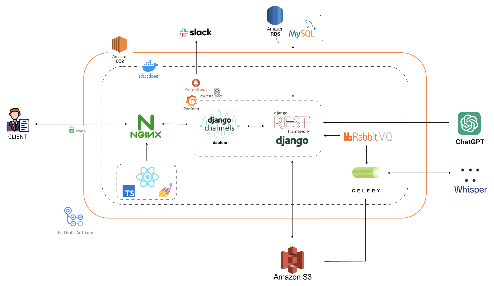
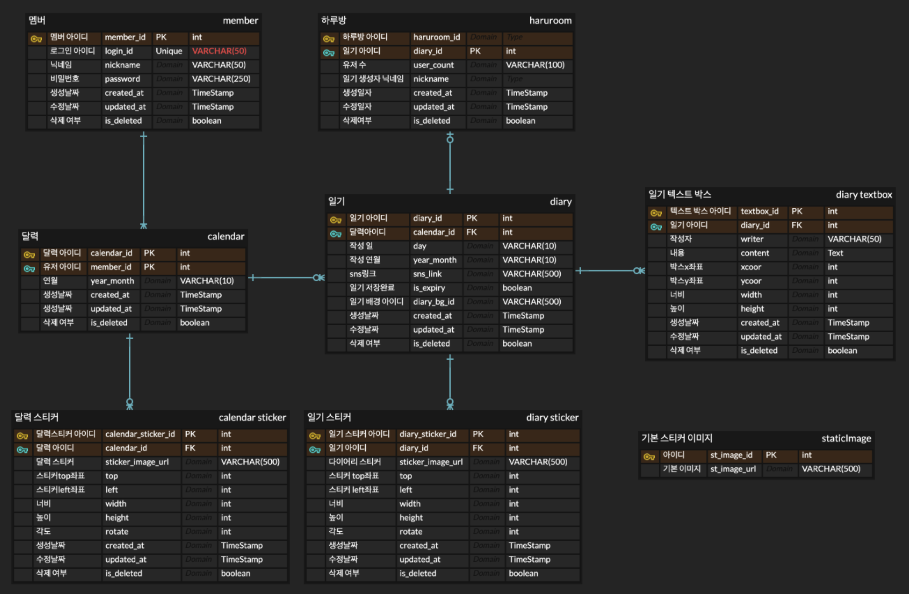
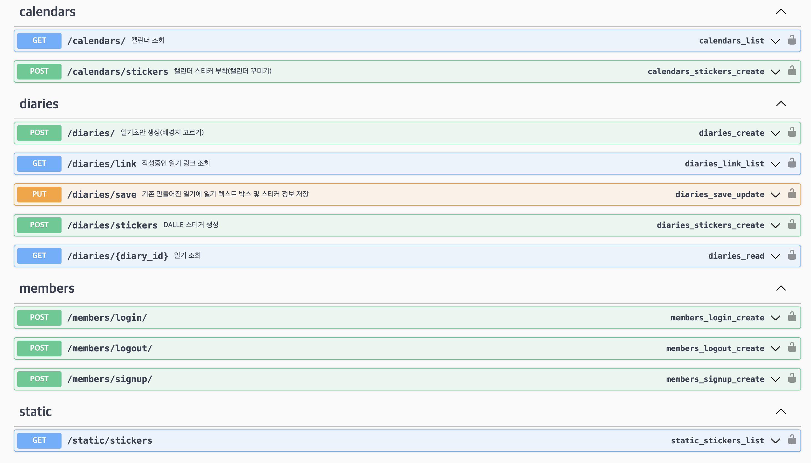
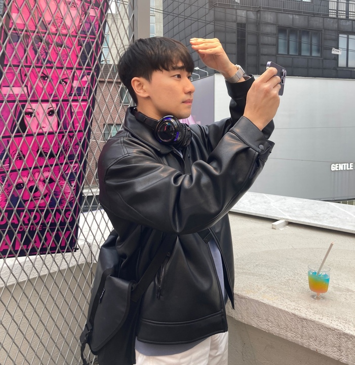

<h1 align="center">
    🐹 HaruCalendar 🐹
</h1>

 
<b>Let’s Share Diaries and Decorate Together! </b> 

  

## 🎨 Introduce

<table width="1200px">
    <thead>
    </thead>
    <tbody>
    <tr>
         <td width="600" align="center">
            
        </td>
        <td width="600" align="center">
            

 
              

🌤️그날의 생각, 감정, 경험을 공유하며 다른 사람들과 하루를 연결해보세요!🌤️

  “하루연결”은 서로가 실시간으로 연결되어 하나의 일기장에서 각자의 일기를 남기고 다양한 스티커로 일기를 꾸밀 수 있는 웹 플랫폼입니다.
  작성한 일기 내용에서 키워드를 추출하여 AI 스티커를 활용해 일기장을 꾸밀 수 있습니다.
  어떤 글을 작성하는지, 어떤 스티커로 일기장을 꾸미는지를 실시간으로 확인할 수 있습니다. 
  

 

</tr>
</tbody>
</thead>
</table>

 
 
 

## 🌈 Feature

### 회원가입 및 로그인  

 
 

###   캘린더 꾸미기 및 다이어리 생성
- 제공 되어지는 기본스티커로 캘린더를 꾸밀 수 있습니다
- 웹소켓 이용 gif 들어 갈 예정

  

- 다이어리 작성 아이콘을 누르면 다이어리 배경지 및 친구와 다이어리를 공유할 수 있는 링크가 생성됩니다. 

 
 

###  다이어리 꾸미기 및 다이어리 작성 
- 공유한 링크를 친구들에게 보내 친구와 함께 세상에 하나밖에 없는 다이어리를 작성 해 보세요~!

 

- 친구들과 다이어리를 작성 후 제공되어지는 기본스티커를 이용하여 다이어리를 꾸미고 "저장"을 누르면 기본적인 작성이 완료가 됩니다.

 
 

### 스티커 붙히기 
- 다이어리에 작성되어진 키워드를 AWS Comprehend가 자연어 처리를 통하여 가장 많이쓰인 키워드 2개를 뽑아줍니다.
- 뽑아진 키워드를 바탕으로 Dall-e 3 가 세상에 하나 밖에 없는 스티커를 만들어 드립니다.

  

 
 

<!-- ## 📹 [Demo](<(https://www.youtube.com/watch?v=RCUEUDk4sVw)>) -->

 
 

## 🛠 ️System Archtecture

## 🔑 ERD

## 💻 Tech Stack

분야| 사용 기술|
:--------:|:------------------------------:|
**Fronted** |        
**Backend** |       
**DevOps** |        
**Monitoring** |       
**etc** |      
)

***

| **Category**           | **Technologies**                                           |
|------------------------|------------------------------------------------------------|
| **Frontend**           | Vite, JavaScript, React, Zustand, Styled-Components, Prettier, Eslint |
| **Backend**            | Django, MySQL, Redis, Channels, Daphne                     |
| **Web Server**         | Nginx                                                      |
| **Asynchronous**       | Celery, Rabbitmq                                           |
| **Database**           | AWS RDS, AWS S3 Bucket MySQL, Redis                        |
| **AI**                 | AWS Comprehend, Dall-E 3                                    |
| **Deployment**         | AWS EC2, Docker                                             |
| **API Test**           | Postman                                                    |
| **API Documentation**  | Swagger                                                    |
| **Others**             | Github, Notion, Zoom, Slack, Figma                         |

 
 
 

## 📗 API

### 일기, 유저 관련 API

 

| Calendars API | Diaries API |Members API|Static API|                                                                                                                                                                             
|---------------|-------------|--|----|
| api/v1/calendars/ : 캘린더 조회  api/v1/calendars/stickers : 캘린더 꾸미기 및 캘린더 생성  |   api/diaries/: 일기 배경지 선택 및 생성 api/diaries/link: 작성중인 일기 및 일기링크 조회. api/diaries/save: 일기 최종저장. api/diaries/stickers: 텍스트박스에서 키워드 추출 후 스티커 생성 api/diaries/<int:diary_id>: 일기 목록 조회          |api/v1/members/login : 사용자 정보 확인, 로그인 api/v1/members/logout: 로그아웃 api/v1/members/signuo : 회원가입|api/v1/static/stickers : 캘린더 및 다이어리 기본 배경지 조회|

                                                                                                                                                                      |
   

## 🐳 How to start

### 1. clone the repository

 
 
 

## 👨‍💻 Members

| [정우희](https://github.com/Joy0w0)         | [정유진](https://github.com/GaBaljaintheroom)  | [조진우](https://github.com/alswlfl29)          | [이동우](https://github.com/gs0428)            | [이도경]()                                     | [강정현]()                                     | [김우성]()                                     
|------------------------------------------|---------------------------------------------|----------------------------------------------|---------------------------------------------|---------------------------------------------|---------------------------------------------|---------------------------------------------|
|  |  |  |  |  |  |  |
| Leader, frontend, DevOps                 | frontend                                    | frontend                                     | Backend, DevOps                             | Backend                                     | Backend                                     | Backend                                     |

